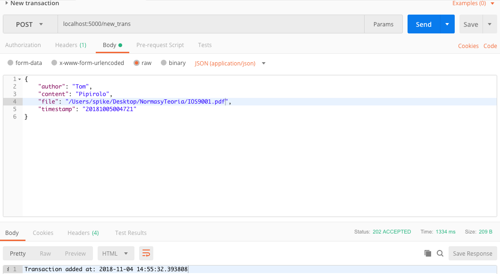
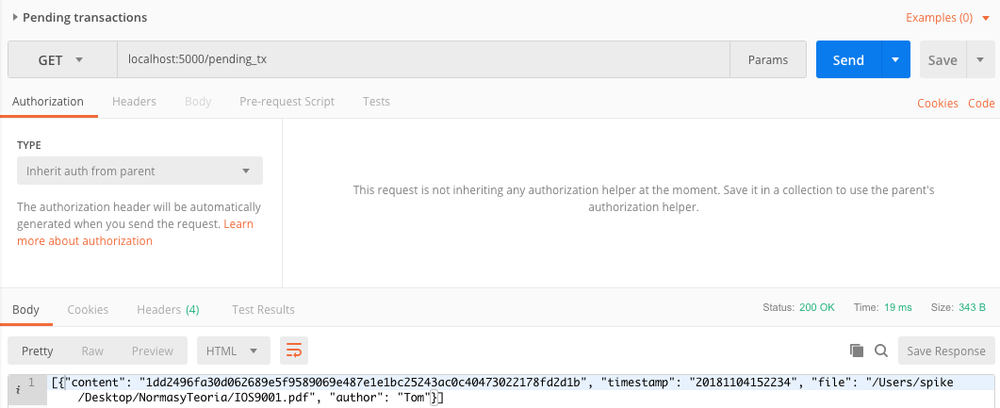
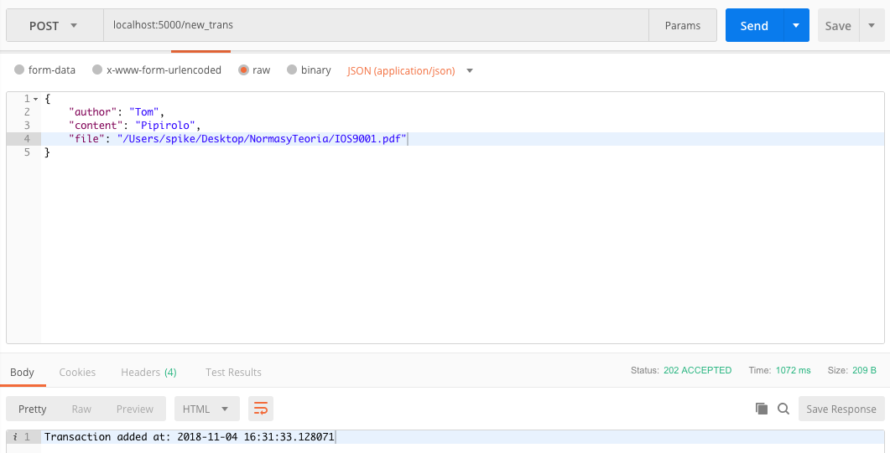
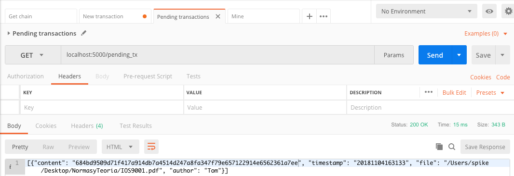

##########################
Integration Test for files
##########################

We are going to make a small test, when we add a file we obtain a hash of its
content but if we change the integrity of the files content we should obtain a
different hasn. Lets make the test!

1. Lets add our original file and check the hash of the content! The hash we
   obtained for the file is::

      1dd2496fa30d062689e5f9589069e487e1e1bc25243ac0c40473022178fd2d1b

**Adding the transaction**

**Checking the transaction**

2. Now lets modify the file by removing some pages and lets upload it as a new
   transaction, the hash we now obtained is::

      684bd9509d71f417a914db7a4514d247a8fa347f79e657122914e6562361a7ee

**Adding the transaction**

**Checking the transaction**

Thats it! Our hashes are different! Therefor we maintain the integrity and with
the timestamp of our original transaction and the one we received later one we
can check that the content of our files are different and the integrity has 
been lost at our file.
