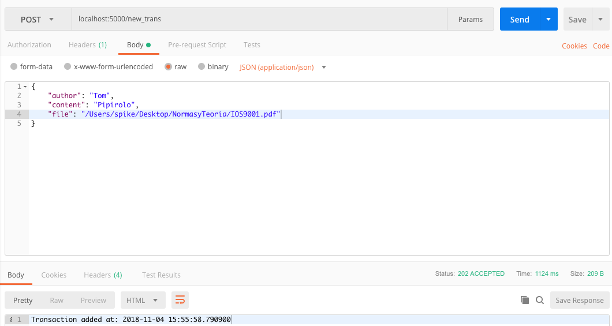
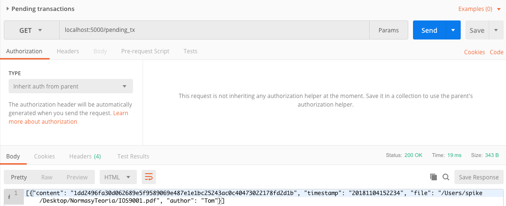

#######################
Running the blockchain!
#######################

Now is where the fun begins!

Lets start by obtaining a fresh chain. Go to postman and run this endpoint::

   localhost:5000/chain

You should see something like this:
      

Now its time to add a new transaction, head to postman again and we go to the endopint and post a transaction as follows::
      
      localhost:5000/new_trans 

Lets check now that the transaction has been posted and its pending to be processed::

      localhost:5000/pending_tx

Now that there is a transaction pending, lets mine it so it is appended into a new block that will be part of the blockchain::

      localhost:5000/mine

Finally lets see the results! Head to the first endpoint and see the result. A new block has been added and it has our transaction!::
   
      localhost:5000/chain

